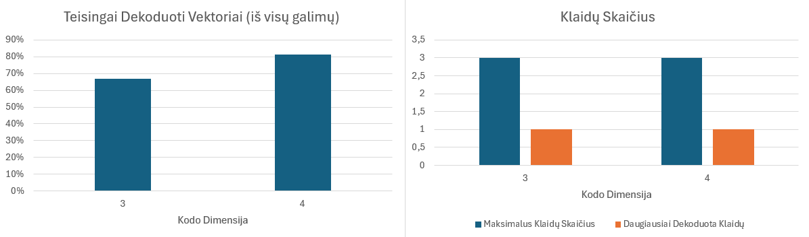

# A11 Tiesinis Kodas (q = 2) Grandininis Dekodavimas

### Kodo parametrai
Kodo parametrus p = ErrorRate (klaidos tikimybė), k = CodeDimension (dimensija), n = CodeLength (kodo ilgis), G = GeneratorMatrix (generuojanti matrica) vartotojas turi nusatyti naudodamas `appsettings.json` failą:
```json
{
    "CodeParameters": {
        "ErrorRate": 0.0001,
        "CodeDimension": 4,
        "CodeLength": 7,
        "GeneratorMatrix": [
            [1, 0, 0, 0, 1, 0, 1],
            [0, 1, 0, 0, 1, 1, 1],
            [0, 0, 1, 0, 0, 1, 1],
            [0, 0, 0, 1, 1, 1, 0]
        ]
    }   
}
```
Taip pat, galima nenurodyti generuojančiosios matricos, t.y arba visiškai pašalinti:
```json
"GeneratorMatrix": [
    [1, 0, 0, 0, 1, 0, 1],
    [0, 1, 0, 0, 1, 1, 1],
    [0, 0, 1, 0, 0, 1, 1],
    [0, 0, 0, 1, 1, 1, 0]
]
```
arba nustatyti vertę `"GeneratorMatrix": null`, nenurodžius generuojančios matricos, programa pati sugeneruos atsitiktinę matricą atitinkančia G = \[Ik|P\] formą.

Pastaba: klaidos tikimybė rašoma su ".", nes JSON failo standartas nepalaiko kablelių sveikosios ir trupmeninės dalies išskyrimui ir neatsižvelgia į operacinės sistemos parametrus.<br />
Pastaba: programa palaiko tik standartinio pavidalo generuojančią matricą, jeigu vartotojo pateikta matrica bus ne standartinio pavidalo, programa baigs darbą.

# Ataskaita

## Trečiųjų šalių funkcijų bibliotekos
- `Microsoft.Extensions.Configuration.*` - naudojama nuskaityti programos konfiguraciją iš failo, įrašoma ir nurodoma `CT.csproj` faile, panaudojama `using Microsoft.Extensions.Configuration`;
- `System.Drawing.Common` - Bitmap biblioteka leidžianti atlikti veiksmus su bitmap tipo duomenimis, panaudojama `using System.Drawing;`;
- `System.Text` - ASCII ir Unicode simbolių kodavimo klasės; abstrakčios bazinės klasės, skirtos simbolių blokams konvertuoti į baitų blokus ir iš jų; ir pagalbinė klasė, kuri manipuliuoja „String“ objektais ir juos formatuoja nekurdama tarpinių „String“ egzempliorių, panaudojama `using System.Text`;
- Visi kiti `using` t.y `using CT.*` naudoja vidinius, šioje programoje aprašytus metodus.

## Programos paleidimas
Turint .NET 8 SDK, programą galima susikompiliuoti iš programinio kodo [src](src/) naudojant `dotnet publish -c Release -r win-x64 --self-contained true` gautas katalogas `bin/Release/win-x64/` atitiks programinį kodą prisegtą užduoties įkėlimo metu.

Norint paleisti įprastai, reikia paleisti `CT.exe` failą, tačiau privalu įsitikinti, kad šalia jo yra `appsettings.json` failas, kuriame nurodyti aukščiau paminėti parametrai, kitaip programa netęs darbo.

Paleidus programą, vartotojas turi pasirinkti įvesties tipą, įvesti norimą vektorių ar tekstą (vektoriaus atveju, taip pat gali pasirinkti ar nori modifikuoti iš kanalo išėjusį vektorių).

## Kodo failų aprašymas
- [Constants/InputType.cs](src/Constants/InputType.cs) - aprašomi galimi įvesties tipai;
- [Extensions/BitmapExtensions.cs](src/Extensions/BitmapExtensions.cs) - aprašomi pagalbiniai metodai su bitmap tipo duomenimis;
- [Extensions/ByteExtensions.cs](src/Extensions/ByteExtensions.cs) - aprašomi pagalbiniai metodai su baitų tipo duomenimis;
- [Extensions/MatrixExtensions.cs](src/Extensions/MatrixExtensions.cs) - aprašomi pagalbiniai metodai su matricomis (byte[][] tipo duomenys);
- [Extensions/StringExtensions.cs](src/Extensions/StringExtensions.cs) - aprašomi pagalbiniai metodai su tekstu (string tipo duomenys);
- [Extensions/VectorExtensions.cs](src/Extensions/VectorExtensions.cs) - aprašomi pagalbiniai metodai su vektoriais (byte[] tipo duomenys);
- [Models/CodeParametersDto.cs](src/Models/CodeParametersDto.cs) - aprašoma programos konfiguracijos struktūra, ja standartizuojant klase;
- [Services/ChannelService.cs](src/Services/ChannelService.cs) - realizuota siuntimo kanalu logika;
- [Services/DecoderService.cs](src/Services/DecoderService.cs) - realizuota dekodavimo logika naudojant pagalbinius metodus;
- [Services/EncoderService.cs](src/Services/EncoderService.cs) - realizuota užkodavimo logika naudojant pagalbinius metodus;
- [Services/InputService.cs](src/Services/InputService.cs) - realizuotas vartotojo įvesties ir procesui reikalingų metodų iškvietimas;
- [appsettings.json](src/appsettings.json) - programos konfigūracinis failas, kuris naudojamas leidžiant programą su .NET 8 SDK;
- [CT.csproj](src/CT.csproj) - programos projekto failas;
- [Program.cs](src/Program.cs) - pradinis programos failas.

## Vartotojo sąsaja
- Paleidęs programą vartotojas mato, kokia naudojama generuojanti matrica G, kokia sugeneruota kontrolinė matrica H;
- Jis turi pasirinkti įvesties tipą (1 - vektorius, 2 - tekstas, 3 - paveikslėlis, 4 - testavimas) įvesdamas atitinkamą skaičių į įvesties terminalą;
- Pasirinkęs vektorių, vartotojas turi jį įvesti be tarpų, įvestas vektorius turi atitikti kodo dimensijos ilgį;
- Po vektoriaus įvedimo, vartotojas pamato savo originalią įvesti, užkoduotą įvestį, išsiųstą įvestį, kiek ir kokios buvo padarytos klaidos;
- Tada vartotojas gali pasirinkti, ar nori redaguoti iš kanalo gautą vektorių prieš dekodavimą;
- Jeigu vartotojas pasirenka pakeisti iš kanalo gautą vektorių, jis turi įvesti naują vektorių, kuris bus naudojamas dekodavimui (ilgis turi atitikti kodo ilgį);
- Gavęs dekoduotą vektorių, vartotojas mato rezultatą ekrane.
---
- Pasirinkęs tekstą, vartotojas turi įvesti tekstą;
- Vartotojui parodoma originali įvestis, užkoduota įvestis (tačiau konvertuota į skaitomą tekstą), išsiųsta įvestis (tačiau konvertuota į skaitomą tekstą), iš kanalo gauta ir dekoduota įvestis ir taip pat įvestis siųsta per kanalą be kodavimo.
---
- Pasirinkęs paveikslėlį, vartotojas turi įvesti jo kelią savo sistemoje (pvz. white.bmp);
- Išsaugomi du nauji failai: decoded_white.bmp ir decoded_noenc_white.bmp, t.y pirmasis yra užkoduotas, išsiųstas kanalu ir dekoduotas, o antrasis yra siųstas kanalu be kodavimo.
---
- Testavimui su skirtingų ilgių vektoriais pateikiamas 4 - asis programos veikimo režimas, kuris pats sugeneruoja visus galimus vektorius ir parodo, originalų vektorių, užkoduotą vektorių, išsiųstą vektorių ir dekoduotą vektorių.

Programos konfiguracijos pavyzdys:<br />


Pavyzdys užkoduojant, siunčiant kanalu ir dekoduojant vektorių (žaliai pažymėtos vartotojo įvestis):


Pavyzdys užkoduojant, siunčiant kanalu ir dekoduojant tekstą (žaliai pažymėtos vartotojo įvestis):


Pavyzdys užkoduojant, siunčiant kanalu ir dekoduojant paveikslėlį (žaliai pažymėtos vartotojo įvestis):


## Programiniai sprendimai
Teksto skaidymas į vektorius:
- Naudojamas Encoding.ASCII.GetBytes(input) metodas, kuris paverčia pradinį tekstą į baitų masyvą;
- Sukuriamas naujas baitų masyvas bits, kurio dydis yra 8 kartus didesnis už pradinį baitų masyvą, nes kiekvienas baitas turi 8 bitus;
- Kiekvienas baitas iš pradinio masyvo yra paverčiamas į bitus naudojant bitų poslinkio operatorių (>>) ir bitų AND operatorių (&);
- Gautas bitų masyvas grąžinamas kaip rezultatas;
- Jei tekstą suskaidžius vektoriais yra negaunamas pilnas vektorius, tai reiškia, kad kažkur įvyko klaida arba neteisingai buvo atliktas skaidymas. Metodas (ConvertToBits iš [Extensions/StringExtensions.cs](src/Extensions/StringExtensions.cs)) užtikrina, kad kiekvienas baitas bus paverstas į 8 bitus, jeigu gaunamas nepilnas bitų masyvas, jo likutis yra užpildomas nuliais.

Teksto vektorių siuntimas kanalu:
- Tekstas, kuris paverstas į bitų masyvą yra toliau skaidomas kodo dimensijos dydžio vektoriais, tai leidžia užtikrinti vientisą užkodavimą ir dekodavimą, tačiau reikalauja į tai atsižvelgti viso proceso metu.

## Ekperimentai

NR. 1
Kodo parametrai (appsettings.json):
```json
{
    "CodeParameters": {
        "ErrorRate": 0.1,
        "CodeDimension": 3,
        "CodeLength": 6,
        "GeneratorMatrix": [
            [1, 0, 0, 1, 1, 0],
            [0, 1, 0, 0, 1, 1],
            [0, 0, 1, 1, 0, 1]
        ]
    }   
}
```

Bandytos įvestys -> Užkoduotas įvestys -> Išsiųstos įvestys -> Klaidos -> Dekoduotos įvestys:
000 -> 000000 -> 000000 -> 0 -> 000<br />
001 -> 001101 -> 000101 -> 1 -> 001<br />
010 -> 010011 -> 011011 -> 1 -> 010<br />
100 -> 100110 -> 000101 -> 3 -> 001!<br />
011 -> 011110 -> 111010 -> 2 -> 111!<br />
101 -> 101011 -> 000001 -> 3 -> 000!<br />
110 -> 110101 -> 110101 -> 0 -> 110<br />
111 -> 111000 -> 011000 -> 1 -> 111<br />

NR. 2
Kodo parametrai (appsettings.json):
```json
{
    "CodeParameters": {
        "ErrorRate": 0.1,
        "CodeDimension": 4,
        "CodeLength": 7,
        "GeneratorMatrix": [
            [1, 0, 0, 0, 1, 0, 1],
            [0, 1, 0, 0, 1, 1, 1],
            [0, 0, 1, 0, 0, 1, 1],
            [0, 0, 0, 1, 1, 1, 0]
        ]
    }   
}
```
Bandytos įvestys -> Užkoduotas įvestys -> Išsiųstos įvestys -> Klaidos -> Dekoduotos įvestys:
0000 -> 0000000 -> 0001000 -> 1 -> 0000<br />
0001 -> 0001110 -> 0001110 -> 0 -> 0001<br />
0010 -> 0010011 -> 0110011 -> 1 -> 0010<br />
0100 -> 0100111 -> 0100111 -> 0 -> 0100<br />
1000 -> 1000101 -> 1000111 -> 1 -> 1000<br />
0011 -> 0011101 -> 1011101 -> 1 -> 0011<br />
0101 -> 0101001 -> 0101001 -> 0 -> 0101<br />
0110 -> 0110100 -> 0110100 -> 0 -> 0110<br />
0111 -> 0111010 -> 0111010 -> 0 -> 0111<br />
1001 -> 1001011 -> 1001010 -> 1 -> 1001<br />
1010 -> 1010110 -> 1011110 -> 1 -> 1010<br />
1100 -> 1100010 -> 1100010 -> 0 -> 1100<br />
1011 -> 1011000 -> 0111000 -> 2 -> 0111!<br />
1101 -> 1101100 -> 1000101 -> 2 -> 1000!<br />
1110 -> 1110001 -> 1111001 -> 1 -> 1110<br />
1111 -> 1111111 -> 1011100 -> 3 -> 1011!<br />

Iš eksperimentų matome, kad tiesinis kodas patikimai ištaiso tik tada, kai siuntimo metu padaryta 1 klaida.

Rezultatai pavaizduoti grafu:<br />


## Pakeitimai po pristatymo
- Programa veikia su apatiniais brūkšneliais<br />
- Atnaujinta statistika, senąją galima rasti [čia](images/statistics_old.png);
- Vykdomas siuntimas kanalu be kodavimo, t.y originalus vektorius išsiunčiamas ir parodomas;
- Perdarytas paveikslėlių kodavimas ir dekodavimas, išsaugomi ilgio ir pločio parametrai.

## Naudota Literatūra
- A11 užduoties aptarimas;
- [Literatūra21.pdf](https://klevas.mif.vu.lt/~skersys/doc/ktkt/literatura21.pdf);
- [Parity-Check matrix](https://en.wikipedia.org/wiki/Parity-check_matrix);
- [Constructing syndrome decoding table](https://math.stackexchange.com/questions/1505517/constructing-syndrome-decoding-table);